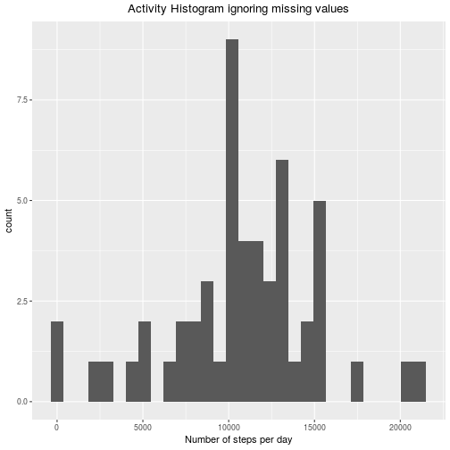
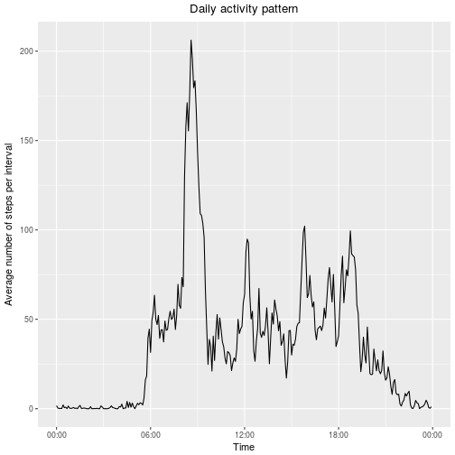
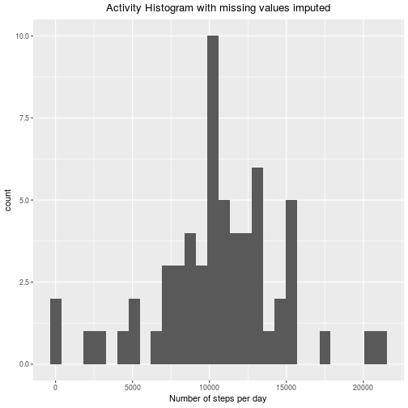
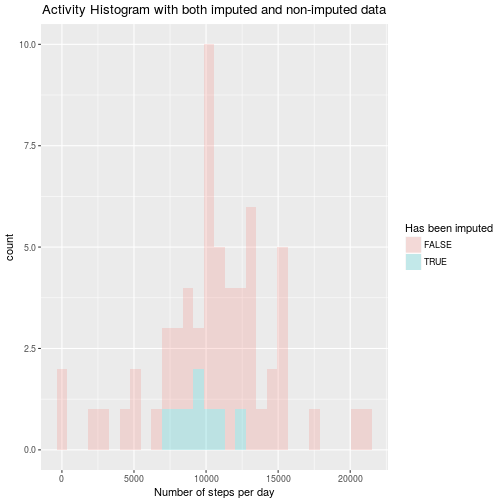
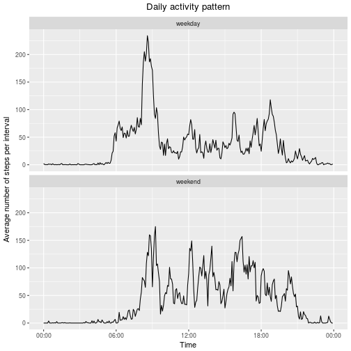

## Introduction
This repo is the submission of the Course Project 1 of the Coursera course "Reproducible Research". Its content corresponds to a simple analysis of fitness tracker data. The instructors require that the following 9 components be present in this report:

1. [Code](#Code for Reading and preprocessing the data) for reading in the dataset and/or processing the data
1. Histogram of the total number of steps taken each day
1. Report on the Mean and median number of steps taken each day
1. Time series plot of the average number of steps taken
1. Report on the 5-minute interval that, on average, contains the maximum number of steps
1. Code to describe and show a strategy for imputing missing data
1. Histogram of the total number of steps taken each day after missing values are imputed
1. Panel plot comparing the average number of steps taken per 5-minute interval across weekdays and weekends
1. All of the R code needed to reproduce the results (numbers, plots, etc.) in the report

Let's start the analysis!

## Analysis
### Code for Reading and preprocessing the data
We first download the data using `download.file`.

```r
URL <- "https://d396qusza40orc.cloudfront.net/repdata%2Fdata%2Factivity.zip";
FN <- "activity.zip";
# download.file(URL,destfile=FN);
```
We now unpack the zipfile and put the result in `df`.

```r
FN_zip <- unzip(FN,list=TRUE)$Name[1];
unzip(FN);
df <- read.csv(FN_zip,stringsAsFactors = FALSE);
df$date <- as.Date(df$date);
df_orig <- df;
```

### Histogram of the total number of steps taken each day {#Histogram}

This part of the analysis considers the total number of steps taken each day. For this analysis, we will ignore missing values.


```r
require(ggplot2)
require(dplyr)
df <- df_orig %>% na.omit()
df_steps_per_day <- df %>% group_by(date) %>%
    summarise(total.Steps.Per.Day=sum(steps))
ggplot(df_steps_per_day,aes(x=total.Steps.Per.Day)) + 
    geom_histogram() +
    labs(x="Number of steps per day", title="Activity Histogram ignoring missing values") +
    theme(plot.title = element_text(hjust = 0.5))
```



### Report on the mean and median number of steps taken each day 


```r
require(knitr)
require(kable)
require(kableExtra)
df_mean_median <- df_steps_per_day %>%             
    summarize(mean=mean(total.Steps.Per.Day),median=median(total.Steps.Per.Day))
kable(df_mean_median, "html",
      caption="The mean and median of the number of steps taken each day") %>%
    kable_styling(full_width = F)
```

<table class="table" style="width: auto !important; margin-left: auto; margin-right: auto;">
<caption>The mean and median of the number of steps taken each day</caption>
 <thead><tr>
<th style="text-align:right;"> mean </th>
   <th style="text-align:right;"> median </th>
  </tr></thead>
<tbody><tr>
<td style="text-align:right;"> 10766.19 </td>
   <td style="text-align:right;"> 10765 </td>
  </tr></tbody>
</table>

### Time series plot of the average number of steps taken {#daily activity pattern}
We are going to purge the rows containing `NA` from the dataframe as we did in [the Histogram Section](#Histogram). We are also transforming the integer in the `interval` column to a proper POSIXct.

```r
require(ggplot2)
require(dplyr)
require(lubridate)
# remove NA values
df <- df_orig %>% na.omit();
# transform the interval column to times 
df$Time <- as.POSIXct(strptime(sprintf("%04d",df$interval),format="%H%M"));
df_average_steps_per_interval <- df %>% group_by(Time) %>%
    summarise(average.Steps.Per.Interval=mean(steps),
              interval=mean(interval));
ggplot(df_average_steps_per_interval,aes(x=Time,y=average.Steps.Per.Interval)) + 
    geom_line() +
    labs(y="Average number of steps per interval", x="Time", title="Daily activity pattern") +
    scale_x_datetime(date_label = "%H:%M") +
    theme(plot.title = element_text(hjust = 0.5))
```



### Report on the 5-minute interval that, on average, contains the maximum number of steps

We can now answer the question which 5-minute-interval, on average, has the largest number of steps. We will re-use `df_average_steps_per_interval` for this pupose, which contains the average number of steps per interval, ignoring `NAs`.


```r
require(ggplot2)
require(dplyr)
require(lubridate)
require(kable)
require(kableExtra)

df_max_steps_interval <- df_average_steps_per_interval %>%            
    summarize(maxSteps=max(average.Steps.Per.Interval),
              Interval.At.Max.Steps=interval[which.max(average.Steps.Per.Interval)],
              Time.At.Max.Steps=Time[which.max(average.Steps.Per.Interval)]);
df_max_steps_interval$`End Time` <- df_max_steps_interval$Time.At.Max.Steps + minutes(5);
names(df_max_steps_interval) <- c("# Steps","Interval ID", "Start Time","End Time");

# for pretty printing: transform the POSIXct objects to strings with hours and minutes
df_max_steps_interval <- df_max_steps_interval %>%
    mutate(`Start Time`=format(`Start Time`,"%H:%M"),
           `End Time`=format(`End Time`,"%H:%M"))

kable(df_max_steps_interval, "html",
      caption="The 5-minute interval with the largest number of steps (on average)") %>%
    kable_styling(full_width = F);
```

<table class="table" style="width: auto !important; margin-left: auto; margin-right: auto;">
<caption>The 5-minute interval with the largest number of steps (on average)</caption>
 <thead><tr>
<th style="text-align:right;"> # Steps </th>
   <th style="text-align:right;"> Interval ID </th>
   <th style="text-align:left;"> Start Time </th>
   <th style="text-align:left;"> End Time </th>
  </tr></thead>
<tbody><tr>
<td style="text-align:right;"> 206.1698 </td>
   <td style="text-align:right;"> 835 </td>
   <td style="text-align:left;"> 08:35 </td>
   <td style="text-align:left;"> 08:40 </td>
  </tr></tbody>
</table>

### Code to describe and show a strategy for imputing missing data

Some of the information in the `steps` column is actually missing. Let's find out the fraction of missing values in the `steps` column.


```r
df <- df_orig;
numRowsMissing <- sum(is.na(df$steps));
numRowsTotal <- dim(df)[1];
meanRowsMissing <- mean(is.na(df$steps));
print(sprintf("Nunber of Rows Missing: %d",numRowsMissing));
```

```
## [1] "Nunber of Rows Missing: 2304"
```

```r
print(sprintf("Nunber of Rows Total: %d",numRowsTotal));
```

```
## [1] "Nunber of Rows Total: 17568"
```

```r
print(sprintf("Average nunber of Rows Missing: %f",meanRowsMissing));
```

```
## [1] "Average nunber of Rows Missing: 0.131148"
```

OK, so about 13% of the steps information are missing (2304 out of 17568). Let's find out if there is some sort of pattern to the missing values.


```r
require(kable)
require(kableExtra)
# create a list that yields the lengths of consecutive runs of missing or not-missing values
dfWithMissing <- df %>% mutate(Missing=is.na(steps));
rleObject <- rle(as.character(dfWithMissing$Missing));
dfLengths <- as.data.frame(unclass(rleObject));
dfLengths$`Start interval` <- head(c(0,cumsum(dfLengths$lengths)),n=-1);
dfLengths <- dfLengths %>% filter(values==TRUE);
dfLengths <- dfLengths %>% select(-values);
dfLengths <- dfLengths %>% mutate(`Start day`=`Start interval`/288)
kable(dfLengths, "html",
      caption="Lengths of consecutive occurences of NA values in the 'steps' column") %>%
    kable_styling(full_width = F);
```

<table class="table" style="width: auto !important; margin-left: auto; margin-right: auto;">
<caption>Lengths of consecutive occurences of NA values in the 'steps' column</caption>
 <thead><tr>
<th style="text-align:right;"> lengths </th>
   <th style="text-align:right;"> Start interval </th>
   <th style="text-align:right;"> Start day </th>
  </tr></thead>
<tbody>
<tr>
<td style="text-align:right;"> 288 </td>
   <td style="text-align:right;"> 0 </td>
   <td style="text-align:right;"> 0 </td>
  </tr>
<tr>
<td style="text-align:right;"> 288 </td>
   <td style="text-align:right;"> 2016 </td>
   <td style="text-align:right;"> 7 </td>
  </tr>
<tr>
<td style="text-align:right;"> 288 </td>
   <td style="text-align:right;"> 8928 </td>
   <td style="text-align:right;"> 31 </td>
  </tr>
<tr>
<td style="text-align:right;"> 288 </td>
   <td style="text-align:right;"> 9792 </td>
   <td style="text-align:right;"> 34 </td>
  </tr>
<tr>
<td style="text-align:right;"> 576 </td>
   <td style="text-align:right;"> 11232 </td>
   <td style="text-align:right;"> 39 </td>
  </tr>
<tr>
<td style="text-align:right;"> 288 </td>
   <td style="text-align:right;"> 12672 </td>
   <td style="text-align:right;"> 44 </td>
  </tr>
<tr>
<td style="text-align:right;"> 288 </td>
   <td style="text-align:right;"> 17280 </td>
   <td style="text-align:right;"> 60 </td>
  </tr>
</tbody>
</table>

We can see that missing values always span entire days (multiples of 288 continuous values), at least one day, at most two days. We can furthermore see that missing values always start at multiples of 288, meaning that not only the timespan of an entire day is missing, but actually one entire day as given by date (from 00:00 to 23:55). We conclude that a useful strategy of replacing the missing values is to replace these missing values with some sort of "typical" activity pattern for a day. 

The question is: what is a "typical" activity pattern? We could simply replace the missing values with the average activity pattern as obtained in [the section concerning the daily activity pattern](#daily activity pattern). However, we are going to follow a slightly more complicated method: We are going to replace the missing values with activity patterns that are mean values as given by a weighted sliding values around the missing values. 

Specifically, we are going to first transform the dataset into a wide form such that each interval (corresponding to the number of steps at the same timepoint during a day) has its own columns. The rows in this dataframe are then the days of observations.

We take this dataframe and replace the `NAs` (at most two consecutive `NAs` for each column) by a weighted average of values of steps in that column. The average is being taken using a moving window around the rows that are `NA`. The weights for the average calculation is calculated using the `linear Weighted Moving Average` scheme: weights decrease in arithmetical progression. The observations directly next to a central value i have weight 1/2, the observations one further away (i-2,i+2) have weight 1/3, the next (i-3,i+3) have weight 1/4, ... .

For details, see `?na.ma` in the `imputeTS` package.


```r
require(tidyr)
require(dplyr)
require(imputeTS)

df <- df_orig;
dfWide <- df %>% spread(interval,steps)
dfWideWithImputation <- na.ma(dfWide,k=4,weighting="linear")

dfLongWithImputation <- dfWideWithImputation %>% 
  gather(key=interval, value=steps, c(2:ncol(dfWideWithImputation))) %>%
  mutate(interval=as.integer(interval)) %>%
  mutate(steps=as.integer((round(steps)))) %>%
  arrange(date,interval) %>%
  # add a column containint the information wich rows have been imputed
  mutate(`Has been imputed`=is.na(df$steps))

dfWithImputation <- dfLongWithImputation[,c(names(df),"Has been imputed")];
```

We will now repeat the histogram plot from [the Histogram Section](#Histogram). This time, we are taking the histogram using a dataframe with imputed values.


```r
require(ggplot2)
require(dplyr)
df <- dfWithImputation;
df_steps_per_day <- df %>% group_by(date) %>%
    summarise(total.Steps.Per.Day=sum(steps))
ggplot(df_steps_per_day,aes(x=total.Steps.Per.Day)) + 
    geom_histogram() +
    labs(x="Number of steps per day", title="Activity Histogram with missing values imputed") +
    theme(plot.title = element_text(hjust = 0.5))
```



A comparison of the two histograms (one with imputed, one without imputed values) is shown in the next plot: 


```r
require(ggplot2)
require(dplyr)

df_steps_per_day <- dfWithImputation %>% group_by(date,`Has been imputed`) %>%
    summarise(total.Steps.Per.Day=sum(steps))

ggplot(df_steps_per_day,aes(x=total.Steps.Per.Day, fill = `Has been imputed`)) +
    geom_histogram(alpha=0.2) +
    labs(x="Number of steps per day", title="Activity Histogram with both imputed and non-imputed data") +
    theme(plot.title = element_text(hjust = 0.5))
```

```
## `stat_bin()` using `bins = 30`. Pick better value with `binwidth`.
```



We see that the imputation mainly affected non-extrem values of numbers of steps per day. Counts of numbers of steps per day have increased by at most 2 in the bin with nearly 10,000 steps. Most of the bins have not been affected.

Finally, ww are reporting on the impact on mean and median values for the number of steps taken per day due to imputation.


```r
require(dplyr)
require(kable)
require(kableExtra)


df_mean_median1 <- df_steps_per_day %>% group_by(`Has been imputed`) %>%            
    summarize(mean=mean(total.Steps.Per.Day),median=median(total.Steps.Per.Day))

df_mean_median2 <- as.data.frame(df_steps_per_day) %>%
  summarize(mean=mean(total.Steps.Per.Day),median=median(total.Steps.Per.Day)) %>%
  mutate(`Has been imputed`="Both")

df_mean_median2 <- df_mean_median2[,names(df_mean_median1)]

df_mean_median <- rbind(df_mean_median1,df_mean_median2) 

kable(df_mean_median, "html",
      caption="The mean and median of the number of steps taken each day, split by imputation status") %>%
    kable_styling(full_width = F)
```

<table class="table" style="width: auto !important; margin-left: auto; margin-right: auto;">
<caption>The mean and median of the number of steps taken each day, split by imputation status</caption>
 <thead><tr>
<th style="text-align:left;"> Has been imputed </th>
   <th style="text-align:right;"> mean </th>
   <th style="text-align:right;"> median </th>
  </tr></thead>
<tbody>
<tr>
<td style="text-align:left;"> FALSE </td>
   <td style="text-align:right;"> 10766.189 </td>
   <td style="text-align:right;"> 10765.0 </td>
  </tr>
<tr>
<td style="text-align:left;"> TRUE </td>
   <td style="text-align:right;"> 9668.625 </td>
   <td style="text-align:right;"> 9633.5 </td>
  </tr>
<tr>
<td style="text-align:left;"> Both </td>
   <td style="text-align:right;"> 10622.246 </td>
   <td style="text-align:right;"> 10571.0 </td>
  </tr>
</tbody>
</table>

We can see that the imputation created days with rather low mean/median numbers of steps. Overall, the total mean went from 10,766 steps per day without imputation to 10,622 steps per day with imputation, corresponding to a drop by 1.3%   .

## Panel plot comparing the average number of steps taken per 5-minute interval across weekdays and weekends

In this section, we will compare the daily activity pattern on weekdays to the daily activity pattern during the weekend. To do that, we create a new factor variable `Daytype` which is `weekday` for weekdays and `weekend` during weekends. We are then plotting a panel plot that compares the daily activity patterns for these two categories. To be as close to reality as we can, we will again ignore missing values.


```r
require(ggplot2)
require(dplyr)
require(lubridate)
require(kable)
```

```
## Loading required package: kable
```

```
## Warning in library(package, lib.loc = lib.loc, character.only = TRUE,
## logical.return = TRUE, : there is no package called 'kable'
```

```r
require(kableExtra)

# remove NA values
df <- df_orig %>% na.omit();
# transform the interval column to times 
df$Time <- as.POSIXct(strptime(sprintf("%04d",df$interval),format="%H%M"));

df$Daytype <- as.factor(ifelse(wday(df$date,week_start=1) %in% 1:5,"weekday","weekend"))

df_average_steps_per_interval <- df %>% group_by(Daytype,Time) %>%
    summarise(average.Steps.Per.Interval=mean(steps),
              interval=mean(interval));

ggplot(df_average_steps_per_interval,aes(x=Time,y=average.Steps.Per.Interval)) + 
    geom_line() +
    facet_wrap( ~ Daytype, nrow=2) +
    labs(y="Average number of steps per interval", x="Time", title="Daily activity pattern") +
    scale_x_datetime(date_label = "%H:%M") +
    theme(plot.title = element_text(hjust = 0.5))
```



```r
# steps performed during weekend and during weekdays
df_mean_median <- df %>% group_by(date,Daytype) %>% 
  summarise(total=sum(steps)) %>%
  group_by (Daytype) %>%
  summarise(mean=mean(total),median=median(total))

kable(df_mean_median, "html",
      caption="The mean and median of the number of steps taken each day, split by daytype category") %>%
    kable_styling(full_width = F)
```

<table class="table" style="width: auto !important; margin-left: auto; margin-right: auto;">
<caption>The mean and median of the number of steps taken each day, split by daytype category</caption>
 <thead><tr>
<th style="text-align:left;"> Daytype </th>
   <th style="text-align:right;"> mean </th>
   <th style="text-align:right;"> median </th>
  </tr></thead>
<tbody>
<tr>
<td style="text-align:left;"> weekday </td>
   <td style="text-align:right;"> 10177.33 </td>
   <td style="text-align:right;"> 10304 </td>
  </tr>
<tr>
<td style="text-align:left;"> weekend </td>
   <td style="text-align:right;"> 12406.57 </td>
   <td style="text-align:right;"> 12130 </td>
  </tr>
</tbody>
</table>

The plot and the table indicate that

 * The person got up later during the weekends
 * The person performed, on average, a higher number of steps during the weekend (abiout 20%)
 * The pattern is not conclusive in order to answer the question if the person regularly performed some sort of sports that increases the number of steps during the weekends


